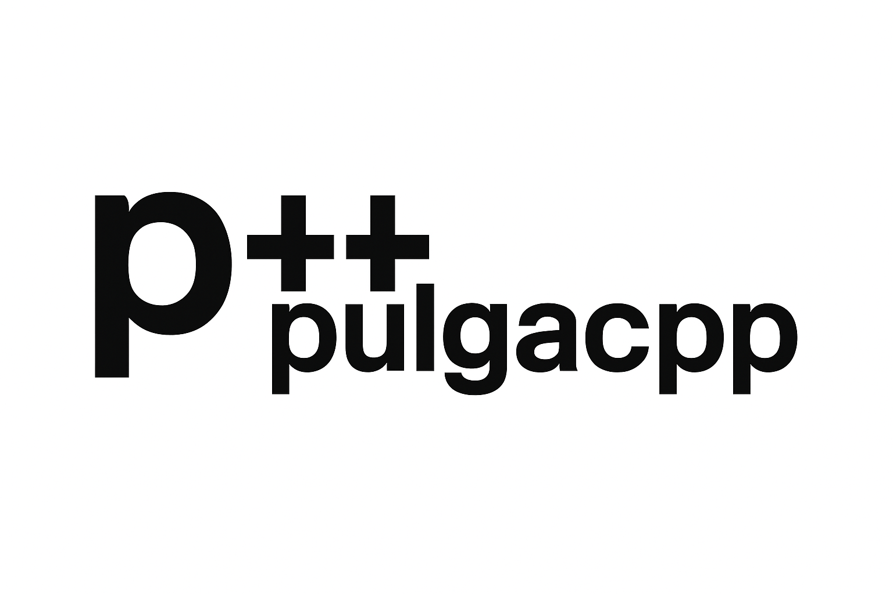

<div align="center">



# 🦗 pulgacpp

### *A Modern Type Library for C++*

[](https://en.cppreference.com/w/cpp/23)
[](https://github.com/JedizLaPulga/pulgacpp)
[](https://opensource.org/licenses/MIT)

**Safe • Versatile • Explicit • Real-World Modeling**

</div>

---

## 🎯 What is pulgacpp?

**pulgacpp** is a comprehensive C++23 type library designed to bring **type safety**, **explicitness**, and **real-world modeling** to C++. 

> 💡 *"pulga"* means "flea" in Spanish — small but mighty! 🦗

This isn't just another integer wrapper. **pulgacpp** aims to provide a rich ecosystem of types that:

- 🔒 **Prevent silent errors** — No undefined behavior, no implicit conversions
- 🌍 **Model the real world** — Shapes, measurements, currencies, and more
- 🧩 **Compose naturally** — Types that work together with clear conversion rules
- ⚡ **Zero runtime overhead** — When you choose raw speed, you get it

---

## 🧠 Philosophy

### The Problem with C++

C++ is powerful, but its type system has gaps:

```cpp
int8_t x = 200;       // Silent truncation 😱
unsigned y = -1;      // Wraps to 4 billion 😱
auto z = a + b;       // Might overflow (undefined behavior) 😱
```

### The pulgacpp Solution

Every type in pulgacpp is designed with **explicitness** at its core:

- **Errors are values** — Use `Optional<T>` and `Result<T, E>` instead of exceptions
- **Conversions are explicit** — Use `.widen()`, `.narrow()`, `.cast()`
- **Operations are intentional** — Choose `checked`, `saturating`, or `wrapping`

---

## 📦 Available Types

### Core Types

| Type | Description | Documentation |
|------|-------------|---------------|
| `Optional<T>` | Rust-style optional with `.unwrap()`, `.map()`, etc. | [optional/](pulgacpp/optional/) |
| `Result<T, E>` | Rust-style error handling with `Ok`/`Err` | [resultdoc](pulgacpp/result/resultdoc.md) |

### Safe Integers

| Signed | Unsigned | Bits | Documentation |
|--------|----------|------|---------------|
| `i8` | `u8` | 8 | [i8doc](pulgacpp/i8/i8doc.md) • [u8doc](pulgacpp/u8/u8doc.md) |
| `i16` | `u16` | 16 | [i16doc](pulgacpp/i16/i16doc.md) • [u16doc](pulgacpp/u16/u16doc.md) |
| `i32` | `u32` | 32 | [i32doc](pulgacpp/i32/i32doc.md) • [u32doc](pulgacpp/u32/u32doc.md) |
| `i64` | `u64` | 64 | [i64doc](pulgacpp/i64/i64doc.md) • [u64doc](pulgacpp/u64/u64doc.md) |
| `isize` | `usize` | ptr | [isizedoc](pulgacpp/isize/isizedoc.md) • [usizedoc](pulgacpp/usize/usizedoc.md) |

### Coming Soon

| Category | Types | Purpose |
|----------|-------|---------|
| **Geometry** | `Point`, `Vector`, `Circle`, `Rectangle` | Safe spatial modeling |
| **Measurements** | `Length`, `Area`, `Volume`, `Angle` | Unit-safe calculations |
| **Time** | `Duration`, `Instant` | Safe time handling |
| **Currency** | `Money<Currency>` | Precise financial types |
| **Collections** | `Slice<T>`, `String` | Bounds-checked containers |

---

## 🚀 Getting Started

### Installation

**pulgacpp** is header-only. Copy the `pulgacpp` folder to your project:

```
your_project/
├── pulgacpp/          ← Copy this folder
│   ├── pulgacpp.hpp
│   └── pulgacpp/
└── main.cpp
```

### Quick Example

```cpp
#include <pulgacpp/pulgacpp.hpp>

using namespace pulgacpp;
using namespace pulgacpp::literals;

int main() {
    // Safe integers with explicit overflow handling
    auto a = 100_i8;
    auto result = a.checked_add(50_i8);  // Returns Optional<i8>
    
    if (result.is_some()) {
        std::cout << result.unwrap() << "\n";
    } else {
        std::cout << "Overflow!\n";
    }
    
    return 0;
}
```

### Compile

```bash
# MSVC
cl /std:c++latest /EHsc main.cpp

# GCC
g++ -std=c++23 main.cpp -o main

# Clang
clang++ -std=c++23 main.cpp -o main
```

---

## 📁 Project Structure

```
pulgacpp/
├── pulgacpp.hpp                 # Master include
└── pulgacpp/
    ├── core/                    # Internal templates
    ├── optional/                # Optional<T>
    ├── i8/, i16/, i32/, i64/    # Signed integers
    ├── u8/, u16/, u32/, u64/    # Unsigned integers
    └── [future: geometry/, time/, currency/, ...]
```

Each type folder contains:
- `<type>.hpp` — The type header
- `<type>doc.md` — Complete documentation
- `main.cpp` — Test suite

---

## 📖 Documentation

Detailed documentation for each type lives in its respective folder:

- **Integers**: See `pulgacpp/<type>/<type>doc.md`
- **Optional**: See `pulgacpp/optional/`

---

## 🛣️ Roadmap

### ✅ Completed
- Safe signed integers: `i8`, `i16`, `i32`, `i64`
- Safe unsigned integers: `u8`, `u16`, `u32`, `u64`
- Pointer-sized integers: `isize`, `usize`
- `Optional<T>` with Rust-style API
- Inter-type conversions: `widen`, `narrow`, `cast`
- STL container compatibility

### 🔜 In Progress
- `Result<T, E>` for rich error handling

### 📋 Planned
- Geometry types: `Point`, `Vector2D`, `Vector3D`, `Circle`, `Rectangle`
- Measurement types with unit safety
- Time types: `Duration`, `Instant`
- Currency types with precision guarantees
- Bounds-checked collections

---

## 🤝 Contributing

Contributions welcome! Whether it's:
- New types
- Documentation improvements
- Bug fixes
- Ideas for future types

Open an issue or PR.

---

## 📄 License

MIT License — use it freely, just keep the attribution.

---

<div align="center">

**Made with 🦗 and C++23**

*Safe types for the real world*

</div>
